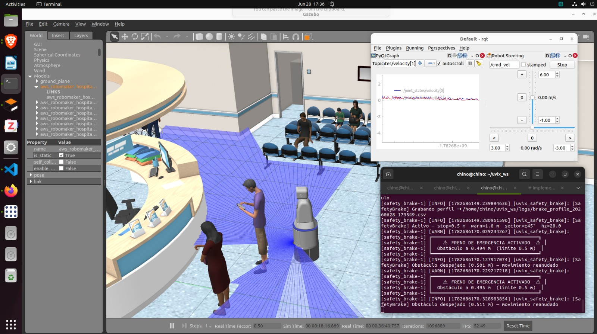

# Uvix — Robot Asistencial Médico

Workspace de **ROS 2** con la simulación de un robot móvil de asistencia hospitalaria (**Uvix**), un prototipo previo del mismo robot (**Bobert**) y un puente de teleoperación por joystick vía UDP. Todo corre sobre **Gazebo Classic**, con navegación autónoma (SLAM + localización) y control diferencial.

<!--
  ── ESPACIO PARA IMÁGENES / GIFS DEMOSTRATIVOS ──
  Sugerencia: crea una carpeta docs/media/ en la raíz del workspace,
  coloca ahí tus capturas/gifs y referencia las rutas relativas aquí.
  Ejemplos de contenido útil para mostrar:
    - Robot cargado en Gazebo dentro del hospital
    - Vista de RViz con el mapa generado por SLAM
    - El robot navegando/evitando obstáculos
    - Teleoperación con el joystick/UDP
-->

## Demo

| Simulación en Gazebo | Mapeo SLAM en RViz |
|:---:|:---:|
| __ | _(imagen pendiente)_ |

| Robot en el mundo hospital | Teleoperación por joystick |
|:---:|:---:|
| _(imagen pendiente)_ | _(imagen pendiente)_ |

> Reemplaza cada `_(imagen pendiente)_` por `` una vez tengas las capturas.

---

## Estructura del workspace

```
uvix_ws/
└── src/
    ├── Uvix_sim/     # Simulación principal del robot Uvix (Gazebo + SLAM + navegación)
    ├── bobert_sim/   # Simulación del prototipo previo "Bobert" (misma arquitectura)
    └── joy_bridge/    # Puente UDP → tópico /joy para teleoperación remota
```

`build/`, `install/` y `log/` son artefactos generados por `colcon build` y están excluidos del repositorio (`.gitignore`); se regeneran localmente al compilar.

## Paquetes

### `Uvix_sim`
Paquete principal de simulación. Contiene:
- **URDF/Xacro** del robot (`urdf/uvix.xacro`) y sus plugins de Gazebo.
- **Mundos** de Gazebo (`worlds/`): hospital de una, dos y tres plantas, construidos con modelos de [AWS RoboMaker](https://github.com/aws-robotics) (`models/`).
- **Control diferencial** vía `diff_drive_controller` + `controller_manager`.
- **Localización** con `robot_localization` (EKF, `config/ekf.yaml`).
- **SLAM** con `slam_toolbox` (`config/mapper_params_online_async.yaml`).
- Nodos propios:
  - `gazebo_ready_watcher`: espera a que Gazebo publique `/clock` antes de spawnear el robot (evita condiciones de carrera al arrancar).
  - `slam_prereq_checker`: verifica que todos los tópicos críticos (`/scan`, `/imu`, `/odometry/filtered`, `/tf`) estén sincronizados con el tiempo de simulación antes de levantar EKF/SLAM.
- **Launch principal**: `launch/sim_launch.py` — arranca Gazebo, robot, controladores, EKF y SLAM en cascada con temporizadores para garantizar el orden correcto.

### `bobert_sim`
Simulación del rover **Bobert**, prototipo anterior a Uvix. Comparte la misma arquitectura (URDF, mundos de hospital, EKF, SLAM, watchers) pero con su propio modelo y controladores (`config/bobert_controllers.yaml`).

### `joy_bridge`
Nodo ligero (`joy_udp_node.py`) que escucha un socket UDP (puerto `5005`) esperando JSON con `axes` y `buttons`, y los republica como mensajes `sensor_msgs/Joy` en el tópico `/joy`. Pensado para teleoperar el robot desde un dispositivo externo (móvil, gamepad remoto, etc.) sin depender de `joy_node` nativo. La configuración de escalas/ejes para `teleop_twist_joy` está en `config/config.yaml`.

## Requisitos

- Ubuntu 22.04
- ROS 2 Humble
- Gazebo Classic 11 (`gazebo_ros`, `gazebo_ros2_control`)
- Paquetes ROS 2: `robot_state_publisher`, `controller_manager`, `diff_drive_controller`, `joint_state_broadcaster`, `robot_localization`, `slam_toolbox`, `xacro`, `rviz2`, `topic_tools`

## Instalación

```bash
mkdir -p ~/uvix_ws/src
cd ~/uvix_ws
# clona este repo dentro de src/ (o clona el workspace completo si ya incluye src/)
rosdep install --from-paths src --ignore-src -r -y
colcon build
source install/setup.bash
```

## Uso

**Simulación completa (Gazebo + robot + SLAM):**
```bash
ros2 launch Uvix_sim sim_launch.py
# o, para el prototipo Bobert:
ros2 launch bobert_sim sim_launch.py
```

**Teleoperación por joystick vía UDP:**
```bash
ros2 run joy_bridge joy_udp_node
```
Envía por UDP al puerto `5005` un JSON con la forma `{"axes": [...], "buttons": [...]}`; el nodo lo republica en `/joy` para que `teleop_twist_joy` (u otro consumidor) lo traduzca a `/cmd_vel`.

**Visualización en RViz:**
```bash
rviz2 -d src/Uvix_sim/config/main.rviz
```

## Licencia

`Uvix_sim` se distribuye bajo licencia Apache-2.0 (ver `src/Uvix_sim/LICENSE`). Los modelos 3D del hospital provienen de [aws-robomaker-hospital-world](https://github.com/aws-robotics/aws-robomaker-hospital-world), también bajo Apache-2.0.
